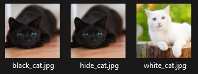
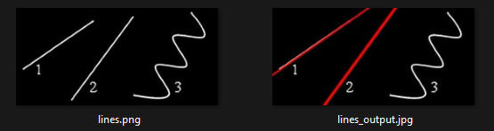
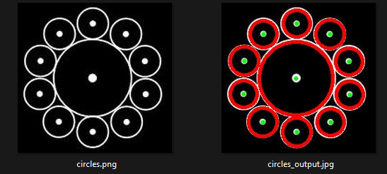

# Ветка hideImg:

1. **Реализация программы для скрытия одного изображения в другом:**
   Эта программа позволяет скрывать одно изображение внутри другого с использованием методов стеганографии.
   
   

# Ветка findCirclesAndLines:

2. **Реализация программы для поиска прямых на изображении:**
   Данная программа позволяет обнаруживать прямые на изображении с использованием алгоритмов компьютерного зрения.

   

3. **Реализация программы для поиска окружностей на изображении:**
   Эта программа обнаруживает окружности на изображении, используя методы компьютерного зрения и алгоритмы обработки изображений.

   
